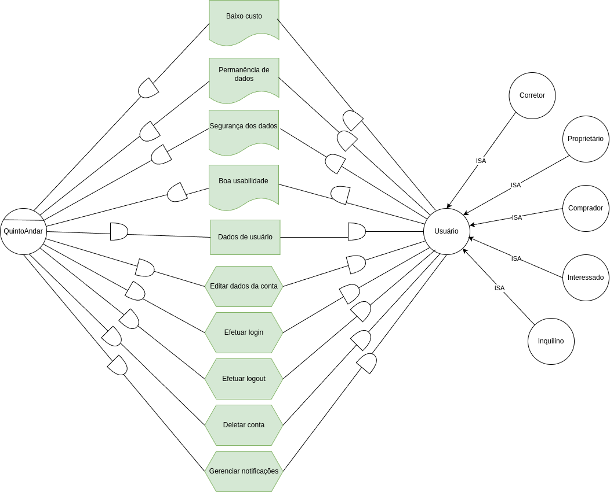
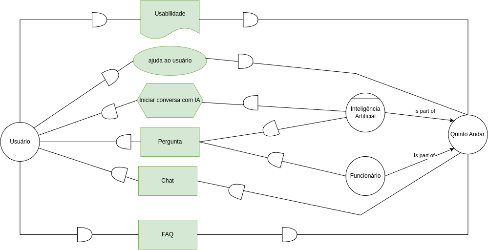

# Gore-i

---

> Metodologia de Engenharia de Requisitos Orientada a Metas que utiliza modelos para representar e analisar as metas, tarefas e dependências entre atores em um sistema. Composta por dois principais modelos: Modelo Estratégico de Dependências (SD) e o Modelo Estratégico de Racionalização (SR). Essa abordagem ajuda a capturar tanto os requisitos funcionais quanto os não funcionais, detalhando como os atores interagem, tomam decisões e realizam tarefas para alcançar seus objetivos. Gore i* facilita a análise e refinamento dos requisitos, garantindo que todos os stakeholders estejam alinhados e que o sistema atenda às suas expectativas.

---

# SD's

## Aluguel de Imóvel

  

## Gerência de Conta

  

## Envio de Mensagens e Arquivos

  

## Suporte

  

---

# SR's

##
##
##
##
##
##

---

# Histórico de versão

|    Data    | Versão |          Descrição           | Autores                                                                                              |
| :--------: | :----: | :--------------------------: | ---------------------------------------------------------------------------------------------------- |
| 07/08/2024 | `1.0`  |    Criação do documento.     | [João Antonio G.](https://github.com/joaoseisei)                                                     |
| 27/08/2024 | `1.1`  |   Desenvolvimendo dos SD's   | [Cássio Reis](https://github.com/csreis72), [Eduardo Sandes](https://github.com/DiceRunner714), [João Antonio G.](https://github.com/joaoseisei) |
| 27/08/2024 | `1.2`  |   Desenvolvimendo dos SR's   | [André Silva](https://github.com/Hunter104), [Cássio Reis](https://github.com/csreis72), [Artur Bartz](https://github.com/H0lzz), [Letícia Hladczuk](https://github.com/HladczukLe)                                                          |
| 02/09/2024 | `1.3`  | Adição dos modelos e revisão | [Eduardo Sandes](https://github.com/DiceRunner714)                                                   |
|            |        |                              |                                                                                                      |

