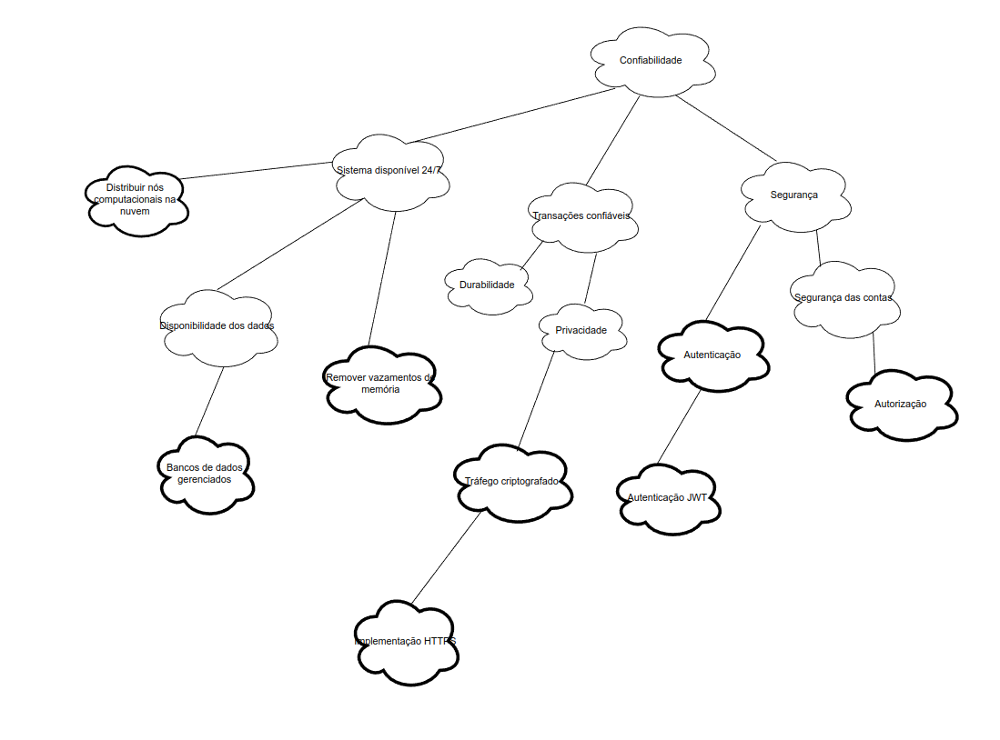
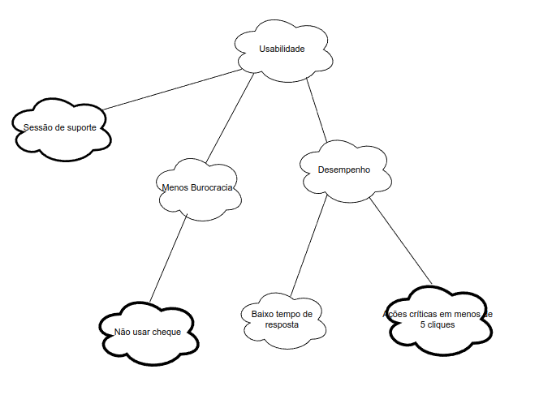
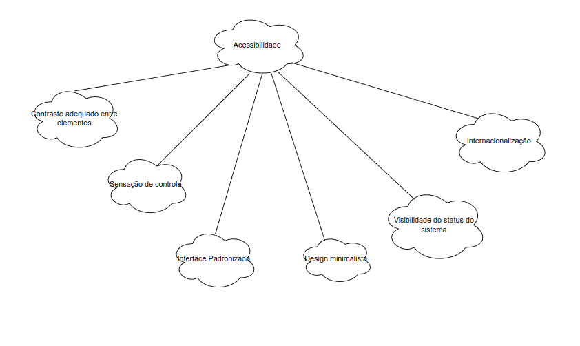

# NFR Framework

---

> Trata-se de um framework conceitual para condução da engenharia de requisitos orientada aos requisitos não funcionais, com uma extensão que apoia suposições para metas flexíveis (softgoals).

---

# NFR's definidas

## NFR001 - Confiabilidade

## NFR002 - Usabilidade 

## NFR003 - Acessibilidade 

# Histórico de versão

|    Data    | Versão |       Descrição        | Autores                                                                                         |
| :--------: | :----: | :--------------------: | ----------------------------------------------------------------------------------------------- |
| 19/08/2024 | `1.0`  | Criação do documento.  | [André Silva](https://github.com/Hunter104), [Eduardo Sandes](https://github.com/DiceRunner714) |
| 19/08/2024 | `1.1`  | Primeira versão do NFR. | [André Silva](https://github.com/Hunter104), [Eduardo Sandes](https://github.com/DiceRunner714)|

