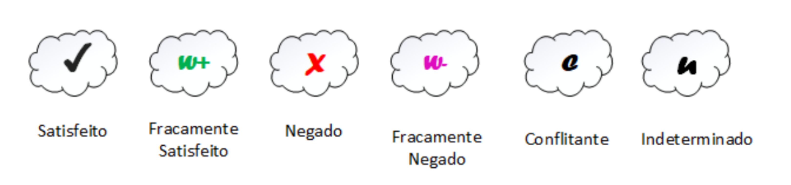
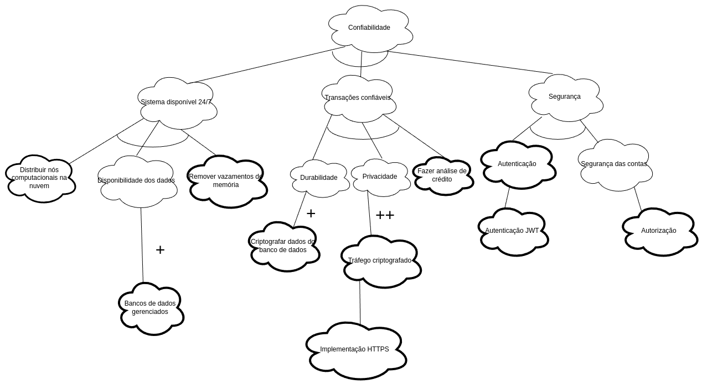
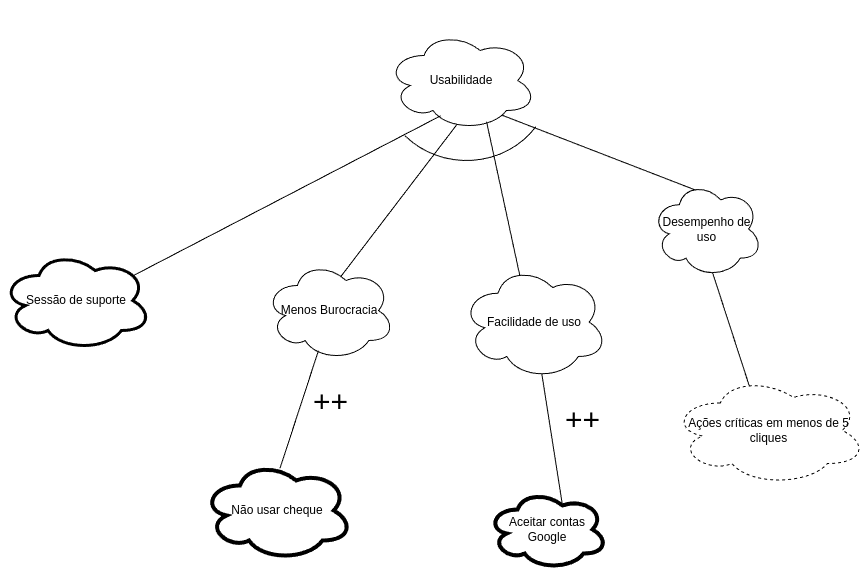
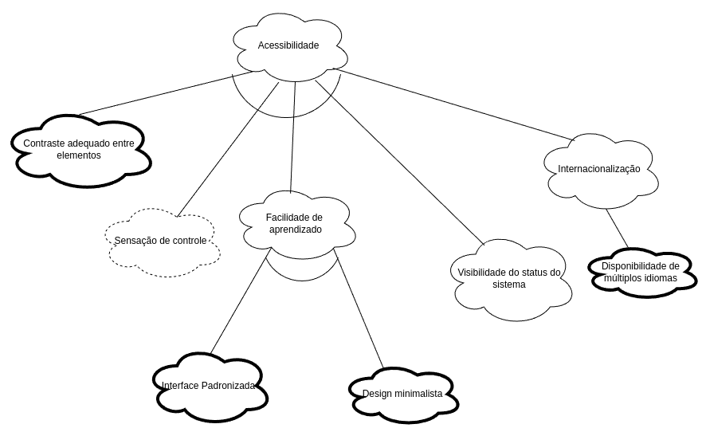
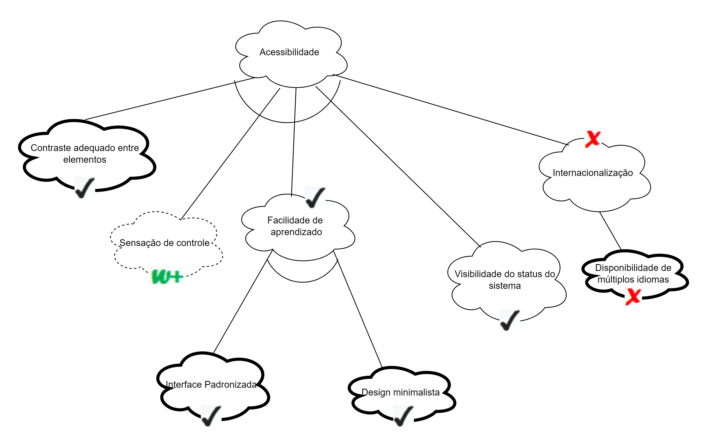
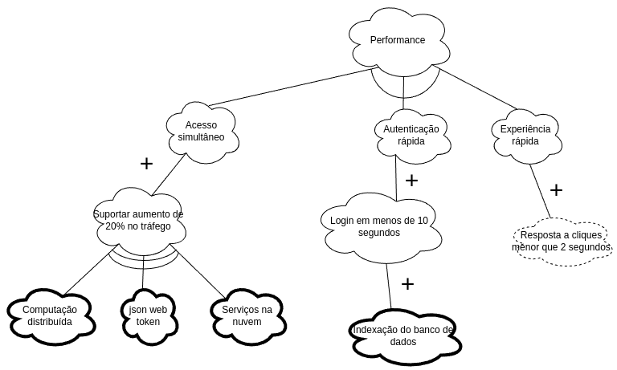
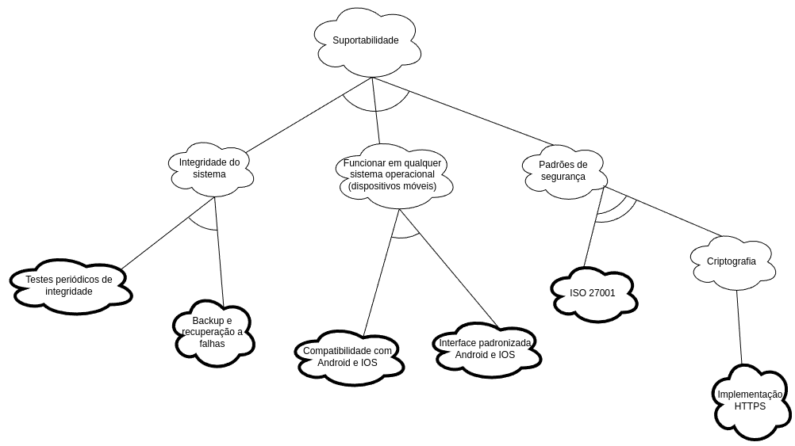
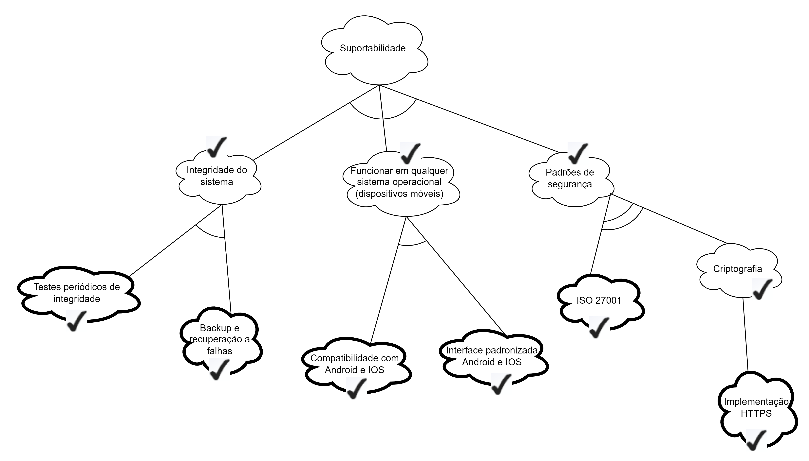

# NFR Framework

---

> Trata-se de um framework conceitual para condução da engenharia de requisitos orientada aos requisitos não funcionais, com uma extensão que apoia suposições para metas flexíveis (softgoals).
> 
> A definição das NFRs foram obtidas a través de um brainstrom, para ver a gravação clique [aqui](https://youtu.be/jSlo0Tva5ms?si=IR2kVmAStQ1PK5Yo).

---

# Procedimento de Avaliação

No NFR Framework, a avaliação dos softgoals é feita através de um algoritmo de rotulagem (*labeling algorithm*) que considera rótulos, contribuições e decisões do desenvolvedor. Esse processo analisa como decisões afetam softgoals de alto nível, utilizando o conceito de satisfação, onde o objetivo é encontrar soluções "boas o suficiente". A avaliação segue um fluxo ascendente no grafo, onde decisões nas folhas impactam softgoals principais. Contribuições positivas propagam a satisfação, enquanto contribuições negativas invertem essa relação, refletindo a complexidade dos requisitos não funcionais.

Os tipos de rótulos são apresentados na figura abaixo:

Descrição:

- Satisfeito: O softgoal pode ser atendido conforme a análise, sendo, portanto, selecionado para implementação.
- Fracamente satisfeito: Há sinais positivos indicando a possibilidade de cumprimento do softgoal.
- Negado: O softgoal não pode ser atendido conforme a análise, e, por isso, não é selecionado para implementação.
- Fracamente negado: Há indícios de que o softgoal não pode ser totalmente cumprido.
- Indeterminado: A realização do softgoal não pode ser confirmada nem descartada.
- Conflitante: Existem divergências que dificultam o cumprimento do softgoal.

# NFR's definidas

## NFR001 - Confiabilidade

## NFR002 - Usabilidade 

## NFR003 - Acessibilidade 

**Com propagação de impactos**

## NFR004 - Performance 

## NFR005 - Suportabilidade 

**Com propagação de impactos**

# Histórico de versão

|    Data    | Versão |           Descrição            | Autores                                                                                                                                           |
| :--------: | :----: | :----------------------------: | ------------------------------------------------------------------------------------------------------------------------------------------------- |
| 19/08/2024 | `1.0`  |     Criação do documento.      | [André Silva](https://github.com/Hunter104), [Eduardo Sandes](https://github.com/DiceRunner714)                                                   |
| 19/08/2024 | `1.1`  |    Primeira versão do NFR.     | [André Silva](https://github.com/Hunter104), [Eduardo Sandes](https://github.com/DiceRunner714)                                                   | ||
| 20/08/2024 | `1.2`  | Adiciona árvores de softgoals. | [André Silva](https://github.com/Hunter104), [Eduardo Sandes](https://github.com/DiceRunner714), [João Antonio G.](https://github.com/joaoseisei) |
|            |        |                                |                                                                                                                                                   |

